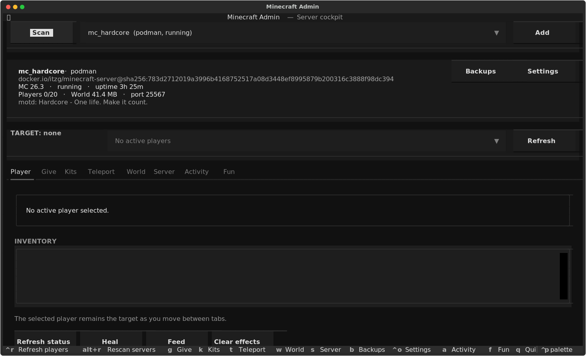
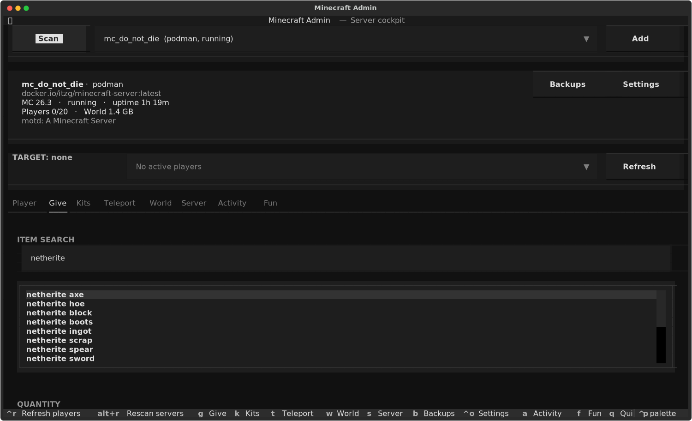
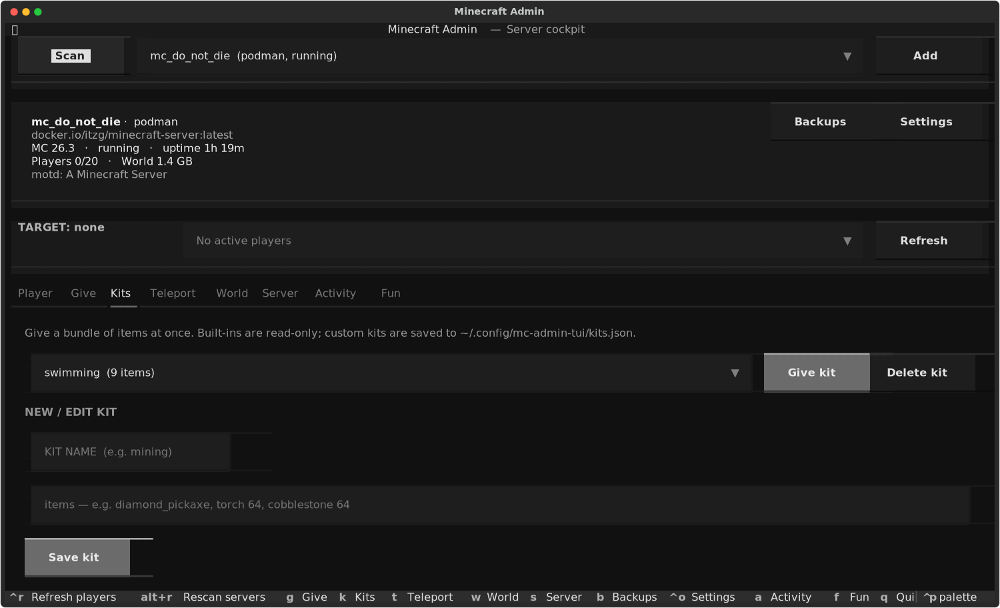
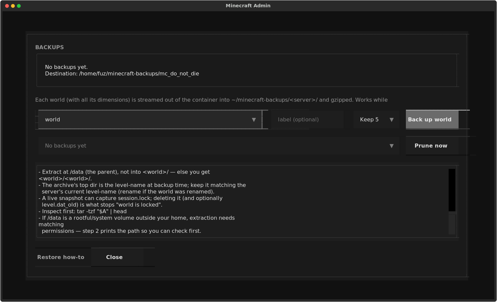

# Minecraft Admin TUI

A Textual-based cockpit for Minecraft Java servers running in **Podman or Docker**
containers.

On startup it scans the host, lists every Minecraft container it can find, and lets
you pick one. The app is designed around a **persistent selected server + selected
player**: pick a server and a player, then Give, Teleport, Player actions and Fun all
operate on those same targets.



The top section shows, for the selected server: runtime, image, Minecraft version,
state, uptime, online players, world size and the published game port — with
**Settings** and **Backups** buttons that open their respective managers as modals.



## How servers are discovered

1. Every container runtime available on the host is probed (`podman`, then `docker`).
2. `ps -a` is inspected and containers whose image matches a known Minecraft server
   image (`itzg/minecraft-server`, `itzg/mc-server`) are kept.
3. For each match the container is probed for an RCON client (`rcon-cli`, `mcrcon`,
   `rcon`) and for RCON credentials.
4. Credentials are auto-detected, in order:
   - `rcon.password` / `rcon.port` in the container's `/data/server.properties` —
     the authoritative values the running server actually authenticates with;
   - `rcon-cli` config inside the container (`/data/.rcon-cli.yaml`,
     `/data/.rcon-cli.env`, or `$HOME/.rcon-cli.*`) — a fallback, since the copy a
     server writes there can go stale and no longer match a live RCON password;
   - `RCON_PASSWORD` / `RCON_PORT` environment variables on the container.

Nothing is required in advance: for an itzg server with RCON enabled, the app finds
the container, locates `rcon-cli`, reads the password from `server.properties` and
runs commands without you supplying it.

Containers that do not ship an RCON client are still listed (for status/logs/restart)
but RCON actions report that no client was found. When the scan finds a single running
server it is selected automatically (running servers sort first; stopped ones are
greyed in the list).

## What is implemented

### Server banner

- **Scan** (left) and **Add** (right) around the server picker
- collapsible details for the selected server: runtime, image, **Minecraft version**,
  state, **uptime**, **online players**, **world size**, MOTD
- **port** — the published host port for the game (`port 25567`), or `port unmapped`
  when the game port is not published to the host
- version comes from the itzg `VERSION` env (e.g. `26.3`), from a Docker-version
  server's `mcxbox.properties`, or from the version comment in `server.properties`
- world size uses `du -sb` when the server is running, else the archive stream
- **Backups** button (same line) opens the backup manager modal
- **Settings** button opens the server properties editor

### Server

- host scan across Podman and Docker
- server picker (runtime + container + state), running servers first, stopped greyed
- manual registration (`Add`) for containers the scan cannot match
- container status, Save all, tail logs, raw RCON
- **Start container**, **Stop container** (type `STOP`) and restart (type `RESTART`)
- Stop/Restart allow at least 60 seconds for graceful shutdown, or the container's
  configured stop timeout if longer
- Start/Restart reuse the existing container; they cannot change its environment,
  image, ports or volumes. The status distinguishes a running container from a
  Minecraft server that may still be loading
- the last used server is remembered and pre-selected next launch

### Server settings

Open **Settings** in the banner or press `Ctrl+O`. The editor reads the selected
server's `server.properties` from its working/data directory and offers:

- multiline **MOTD**, including Unicode and Minecraft `§` formatting codes
- maximum players, difficulty, default game mode and force game mode
- PvP, whitelist and enforcement, flight, mob spawning and Nether access
- view/simulation distance, spawn protection and idle kick timeout

Only properties already present in the file are editable; missing/version-specific
properties are listed, not added with guessed defaults. Numeric ranges and boolean/
choice values are validated before any write. Unknown properties, credentials,
comments, file permissions and numeric ownership are preserved.

**Save does not apply these changes live or restart the server.** Close the modal,
then use Server → type `RESTART` → Restart container, or Start if it is stopped.
World's existing difficulty/time/weather/gamerule buttons remain live RCON actions.
Reload and Close/Escape ask before discarding unsaved edits; failed saves retain them.

#### Container startup configuration

The [itzg image normally manages `server.properties` at startup](https://docker-minecraft-server.readthedocs.io/en/latest/configuration/server-properties/).
For persistent TUI-managed settings, add this to the deployment:

```yaml
environment:
  OVERRIDE_SERVER_PROPERTIES: "false"
```

Recreate the container through its deployment tool, **retaining the existing data
volume**, to apply an environment change. A simple container restart is insufficient.
`SKIP_SERVER_PROPERTIES=true` is also accepted when you manage creation of the file
yourself. With manual property management enabled, later property-related environment
changes no longer update the existing file; edit the file/TUI instead.

The TUI blocks Settings saves and Start/Restart for itzg containers without either
flag, and explains the required deployment change. Stop remains available. Generic
images are not gated, but their startup scripts must likewise preserve file edits.
The TUI never recreates containers. Auto-remove containers and services such as
Quadlet must be recreated/started by their deployment owner, then rediscovered with
Scan; container Start cannot recreate a removed container.

Settings use container copy streams, including for stopped servers. Podman ownership
preservation also requires `stat`; stopped Podman editing requires a persistent data
mount on this host and the default user namespace. Start a container with a custom
user namespace before editing it. If ownership cannot be determined safely, no
settings are written.

An external edit detected before writing is rejected; Reload to get the new file.
Container copy is not an atomic compare-and-swap: avoid simultaneous external
writers. After a failed/timed-out copy, Reload to inspect the actual file before
retrying, since the copy may have partially completed.

### Player

- live active-player picker (`rcon-cli list`); the selected player persists across tabs
- health, food, XP, dimension and coordinates
- **inventory** (item, quantity and slot per entry)
- heal, feed, clear effects
- Survival / Creative / Spectator
- add 10 XP levels

### Give

- fuzzy item search / autocomplete
- aliases such as `fireworks`, `wither skull`, and `deep slate`
- quantity control
- exact Minecraft item IDs
- optional generated-registry support (see below)

### Teleport

- selected player → another online player
- teleport to coordinates
- cross-dimension teleport
- save the selected player's current position as a named location
- teleport to / delete saved locations

### World

- `keepInventory` on/off and status. The correct spelling is resolved against the
  server at runtime (`keepInventory` vs `keep_inventory`) — newer servers reject the
  camelCase form, which the app probes for automatically
- time: day / noon / night / midnight
- weather: clear / rain / thunder
- difficulty: peaceful / easy / normal / hard

### Kits

- give a whole bundle of items in one action (one `give` per item, sent in order)
- built-in kits: `starter`, `tools`, `nether`, `pvp`, `food`, `swimming`
- `swimming` is a full enchanted diving loadout (respiration turtle helmet, depth
  strider boots, riptide + loyalty tridents, water-breathing / night-vision potions,
  golden carrots) — entries use item components, e.g.
  `minecraft:trident[enchantments={"minecraft:riptide":3,…}]` and
  `minecraft:potion[minecraft:potion_contents={potion:"minecraft:long_water_breathing"}]`
- an entry containing a space is sent as a bare command instead of a `give`, so kits
  can also hold gamerule/`save-all` style commands
- define custom kits inline: name + comma-separated `item [qty]` list
  (`diamond_pickaxe, torch 64, cobblestone 64`); namespaces default to
  `minecraft:` and quantities are clamped to 1–6400
- custom kits persist to `~/.config/mc-admin-tui/kits.json` and override built-ins of
  the same name; built-ins are read-only (Delete refuses them)



### Backups

- one-click world backup, streamed live out of the container (no downtime)
- `save-all` runs first, so the archive is a clean, flushed copy
- each world is a single archive containing every dimension (`world/`, `world/DIM-1/`,
  `world/DIM1/`, `world/data/`, `world/level.dat`, …)
- works for **running and stopped** containers alike (uses `podman|docker cp` streaming,
  not `exec`)
- per-server destination `~/minecraft-backups/<container>/`, gzipped, timestamped, with
  optional label
- retention control: keep 5 / 10 / all, plus a manual **Prune now**
- opened as a modal from the **Backups** button (or `B` / `Ctrl+B` / `⌥B`); `Esc`
  closes it, so it is not part of the tab rotation
- **Restore how-to** button in the modal prints the full manual restore steps
  (`<runtime> stop`, find the `/data` volume, `mv` the old world aside,
  `tar -xzf … -C $VOL`, `rm -f $VOL/<world>/session.lock`, start) — key points:
  extract at the **parent** of the world dir, keep the top-level dir name matching
  `level-name`, and delete the stale `session.lock` a live snapshot may contain
- restore is intentionally out of scope — archives are plain `tar.gz` you can extract
  yourself:

  ```bash
  tar -xzf ~/minecraft-backups/<container>/world-<stamp>.tar.gz -C /path/to/server-data
  ```

  Restore target is the server's world directory, e.g. `/data/world` inside the
  container or its backing volume; stop the container first.



### uNmINeD maps

In the **Backups** modal, choose a discovered world and select **Create uNmINeD
map**. The TUI runs `save-all`, streams that world out of the container to a
temporary local copy, then runs `unmined-cli web render`. The map is written under
`~/minecraft-maps/<container>/<world>/`. After rendering, the TUI starts a read-only
HTTP server and displays a LAN URL for the map. It binds to the host's detected
`10.1.1.0/24` address on TCP port `8765`; keep the TUI running while other machines
view it. Allow that port through the host firewall if needed. The server has no
authentication: anyone who can reach it can read all maps under
`~/minecraft-maps/`. Temporary world files are removed after rendering; this does
not create a backup archive.

### Activity / Fun

- in-app audit trail for admin actions
- totem particles, note-block ding, glowing effect, BONK title, summon a chicken,
  lightning strike

The lightning button is intentionally labelled as dangerous because it can hurt the
selected player.

## Generated hub world (Minecraft 26.3)

`mc_hub_world.py`, `mc_hub.py`, and `mc_hub_deploy.py` provide a generated
**vanilla Java 26.3** selection/control hub. The hub discovers Podman Minecraft
containers, including stopped containers; Docker is not supported by this controller.
Each destination gets a stable portal bay with its container name, live status,
player count, readiness lamp, Start/Stop signs, and an editable owner-label sign.
Discovery is limited to 128 stable bay IDs. Removed destinations remain visible as
Missing; IDs are not reassigned to unrelated containers.

### Deploy

Run as the host user that owns the Podman containers, from this checkout:

```bash
python3 -m mc_hub_deploy \
  --address 10.1.1.232 --bind-address 10.1.1.232 --port 25565 \
  --admin YOUR_AUTHENTICATED_UUID:YourPlayerName
```

Use your own player-reachable address and authenticated Minecraft UUID/name.
Deployment creates an isolated `mc_hub` container and `mc_hub_data` volume, pins
vanilla Minecraft to `26.3`, publishes RCON only on `127.0.0.1:25579`, and enables
`mc-hub-controller.service` as a systemd user service. The initial whitelist contains
the administrators supplied through repeatable `--admin` options.

The hub's default game port is `25565`, so players can join by hostname/IP
without a port suffix. Destinations must use distinct published game ports:
for example, `mc_do_not_die` on `25569`, Hardcore on `25567`, and AI Director
on `25555`. Changing a published port requires recreating that container with
the same data volume; it does not require rebuilding or moving the world.

The controller starts the hub in its main process and waits for RCON readiness.
It deliberately avoids `ExecStartPre=podman start`: systemd kills that command's
children, including rootless Podman's network forwarder. Restarting or stopping
the controller preserves container networking and does not stop the hub container.
Generated blocks are flushed to disk before their bay mapping is marked complete,
including when an empty vanilla server pauses before its normal autosave.

Existing destinations are **not restarted** during deployment. `--rebuild` explicitly
regenerates managed geometry while preserving existing owner-label signs;
`--no-service` leaves controller startup to you. Do not rebuild while people are
using the hub.

### In-world controls

- Join with a Java **26.3** client. Walk into an arch to request a transfer. A running
  container is not necessarily joinable; its status sign and controller status
  report destination requirements.
- Start/Stop requires both an authenticated administrator UUID in the configuration
  and `"control": true` for the destination. Stop requires a second click within
  ten seconds and refuses occupied servers. Stops use the container's graceful
  shutdown period. The hub itself cannot be stopped through a bay.
- Stand by the owner-label pedestal as an administrator to edit its unwaxed oak
  sign. The datapack temporarily permits survival-mode sign editing there while
  disabling block breaking; elsewhere players remain in Adventure mode. Managed
  status/control signs are waxed and rewritten by the controller.
- Whitelisted visitors can browse and join ready destinations but cannot start
  or stop them. Add visitors using the hub's normal Minecraft whitelist commands.

### Configuration and operations

Private configuration: `~/.config/mc-admin-tui/hub.json`.
Stable bay mapping: `~/.local/share/mc-admin-tui/hub-state.json`.
Treat the configuration as a secret: it contains the hub's RCON password.
Back up the hub volume and mapping together.

Deployment initially enrolls eligible vanilla 26.3 destinations whose server
properties are not overwritten at startup, excluding names containing `test` or
`rollback`. Subsequently discovered containers are displayed but remain view-only
until explicitly enrolled in `targets`. Review this policy before admitting users.
For a destination entry, `"control": true` enables lifecycle controls; optional
`"address"` and `"port"` override the player-reachable transfer endpoint. Restart
the controller after editing the configuration.

```bash
python3 -m mc_hub status
systemctl --user restart mc-hub-controller.service
journalctl --user -u mc-hub-controller.service -n 50 --no-pager
```

Transfer destinations must actually run vanilla 26.3 with `online-mode=true`,
RCON enabled, `accepts-transfers=true`, and a game port reachable from the player's
computer. Starting a stopped enrolled destination enables incoming transfers
before launch. An already running destination with transfers disabled is left
unchanged; enable transfers during a planned stop/start, not while players are
online. Conflicting published ports prevent a start.

Minecraft receives neither a Podman socket nor host command access. The host-side
controller authenticates live player UUIDs and accepts only fixed join/start/stop
requests. This is vanilla `/transfer`, not a proxy: destinations do not
automatically return players to the hub when they stop.

## Install
The optional **uNmINeD map** action additionally requires the external
`unmined-cli` executable on `PATH`. It renders a selected world to
`~/minecraft-maps/<container>/<world>/` and serves it from the Backups modal;
see [uNmINeD maps](#unmined-maps) for the LAN and firewall requirements.

```bash
python -m venv .venv
source .venv/bin/activate
pip install -r requirements.txt

python mc_admin_tui.py
```

Or install the project:

```bash
pip install .
mc-admin-tui
```

The old entry point is retained too:

```bash
python mc_give_tui.py
```

## Usage

Scan-and-pick is the default:

```bash
mc-admin-tui
```

Preselect a specific server:

```bash
mc-admin-tui --runtime podman --container mc_do_not_die
mc-admin-tui --container oneblock          # runtime auto-detected from the scan
```

Explicit credentials (only needed when auto-detection cannot find them, e.g. an
external RCON endpoint):

```bash
mc-admin-tui --container mc_custom --password hunter2 --rcon-client rcon-cli
```

Full option list: `mc-admin-tui --help`.

## Controls

- `g` `k` `t` `w` `s` `a` `f` — jump to Give / Kits / Teleport / World / Server /
  Activity / Fun (also `Ctrl+<key>` and `Alt+<key>`; on macOS the Alt form is
  `Option+<key>`). A jump focuses the tab bar, so one `Tab` then moves into the first
  field of that tab (e.g. `g`, `Tab` → the item search box)
- `b` / `Ctrl+B` / `⌥B` — open the Backups modal (`Esc` closes)
- `Ctrl+O` — open Settings; `Esc` closes, with confirmation for unsaved edits
- `Alt+R` — rescan the host for servers
- `Ctrl+R` — refresh online players
- `q` — quit when the focused widget isn't consuming the key

While a text field has focus its letters go to the field; use the `Alt`/`Option`
(and `Ctrl`) variants to switch tabs from there. While a modal is open, application
hotkeys are suspended so its editors and selectors keep their keys.

## Config and state files

```text
~/.config/mc-admin-tui/servers.json            known servers + last used
~/.config/mc-admin-tui/locations/<server>.json saved locations, per server
~/.config/mc-admin-tui/kits.json               custom kits
~/.cache/mc-admin-tui/items.json               cached item catalogue
~/minecraft-backups/<container>/               world backups (tar.gz)
~/minecraft-maps/<container>/<world>/          rendered uNmINeD web maps
```

Locations are namespaced per container, so `Home` for one server does not collide
with `Home` for another. A pre-existing shared `locations.json` is imported into the
first server you open and then renamed to `locations.legacy.json.imported`.

Passwords read from the container are stored in `servers.json` so the app can
reconnect without re-scanning. That file is written with the same permissions as your
user config; treat it as sensitive.

## Full item catalogue

The app ships a bundled `registries.json` baseline (generated from this host's
server), so autocomplete is exact out of the box — currently **1658 items**.

Resolution order for the catalogue:

1. `--registry <path>` — import a specific `registries.json` (also caches it, below)
2. `~/.cache/mc-admin-tui/items.json` — a previously imported/cached catalogue
3. the bundled `registries.json`
4. a small built-in starter list (only if none of the above load)

To refresh the baseline against the exact version you run, generate Mojang's
`registries.json` with the matching server jar:

```bash
java -DbundlerMainClass=net.minecraft.data.Main \
  -jar server.jar \
  --reports \
  --output generated
```

Then import it once:

```bash
mc-admin-tui --registry generated/reports/registries.json
```

The file also carries other registries (`entity_type`, `block`, …); `minecraft:item`
drives item search and `minecraft:entity_type` is available for entity pickers.

## RCON assumptions

The TUI runs commands in the same shape as before:

```text
podman exec -w /data -i mc_do_not_die rcon-cli --password <pw> "<minecraft command>"
```

The Python process therefore needs permission to invoke Podman/Docker on the host.
Command shape adapts to the detected client: `mcrcon` uses `-H/-P/-p` flags instead.

## Notes

Player status is collected with vanilla `data get entity` commands. The TUI refreshes
the online-player list every 5 seconds and selected-player status every 10 seconds.

Backups have no automated restore by design. The Backups modal's **Restore how-to**
button prints the manual steps, and the Backups section above has an extract one-liner
(`tar -xzf … -C <server-data-dir>`; stop the container first).
